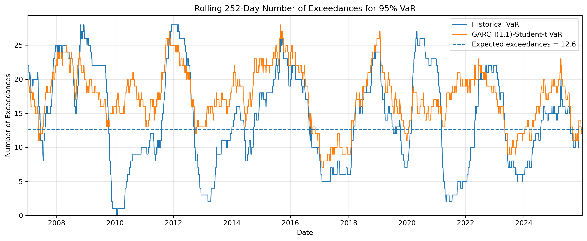

# Global Equity ETF VaR Backtesting

[](https://github.com/igorzatorski/BSc-Dissertation/actions/workflows/tests.yml)

An empirical comparison of Historical, parametric and GARCH-based Value-at-Risk models for a global equity ETF portfolio.

**Igor Zatorski** · BSc Investment and Financial Risk Management · Bayes Business School · May 2026  
**Academic supervisor:** Dr Malvina Marchese  
**Industry collaboration:** S&P Global

S&P Global provided industry context during the dissertation. This repository contains no proprietary S&P Global data, code or presentation materials.

[Read the dissertation](docs/dissertation/Igor_Zatorski_Dissertation.pdf) · [Methodology](docs/methodology.md) · [Detailed setup](docs/running-the-project.md) · [Reference results](results/reference_backtesting_results.csv)



## Research question

Does modelling heavy tails and changing volatility improve one-day VaR forecasts relative to a simple Historical VaR benchmark?

The project compares five models at the 95% and 99% confidence levels using a common 252-day rolling window. Every forecast for date `t` uses returns available strictly before `t`, preventing look-ahead bias.

| Model | Main assumption |
|---|---|
| Historical VaR | The empirical distribution of past returns represents future tail risk |
| Normal VaR | Returns follow a Normal distribution with rolling mean and volatility |
| Student-t VaR | A fitted Student-t distribution captures heavier tails |
| GARCH(1,1)-Normal VaR | Conditional volatility changes over time; innovations are Normal |
| GARCH(1,1)-Student-t VaR | Conditional volatility changes over time; innovations have heavier tails |

## Data and portfolio

The analysis uses adjusted daily prices from Yahoo Finance for ten US-listed global equity ETFs: SPY, EWA, EWC, EWG, EWH, EWJ, EWL, EWU, EWT and EWZ. The sample covers 3 January 2005 to 31 December 2025.

The portfolio starts at USD 1 million, assigns 10% to each ETF and assumes daily rebalancing. VaR is estimated from portfolio log returns. Transaction costs, spreads and taxes are excluded, and the international ETFs combine local equity and currency exposure from the perspective of a USD investor.

## Main results

Historical VaR produced the lowest coverage error at both confidence levels. The GARCH models performed better in the Christoffersen independence test, indicating less clustering of breaches. No model passed every backtesting criterion.

| Model | 95% breach rate | 99% breach rate |
|---|---:|---:|
| Historical VaR | 5.83% | 1.71% |
| Normal VaR | 5.91% | 2.70% |
| Student-t VaR | 6.88% | 1.87% |
| GARCH(1,1)-Normal VaR | 6.70% | 2.39% |
| GARCH(1,1)-Student-t VaR | 6.96% | 1.91% |

The expected breach rates are 5% and 1%. All ten model/confidence combinations were rejected by the Kupiec unconditional coverage test. Historical, Normal and Student-t VaR were also rejected by the independence test at both levels; the two GARCH specifications were not. Failure to reject independence is evidence consistent with independent breaches, rather than proof of independence.

These figures come from 5,029 backtesting observations and match the submitted dissertation. Complete numeric and formatted tables are available in [`results/`](results/).

The rolling exceedance charts begin after 252 forecast observations have accumulated; the initial missing values are expected because no complete rolling window exists before that date. Runs with fewer than 253 forecasts skip these charts with a warning, as at least two complete windows are needed to draw a line. This diagnostic window remains 252 days even when the model calibration window is changed.

## Project structure

```text
├── run_analysis.py              # Main entry point
├── src/var_backtesting/
│   ├── config.py                # Research settings and ETF metadata
│   ├── data.py                  # Price download and validation
│   ├── portfolio.py             # Portfolio construction
│   ├── models/                  # Five VaR models
│   ├── backtesting.py           # Kupiec and Christoffersen tests
│   ├── reporting.py             # Result tables
│   ├── plotting.py              # Research figures
│   └── pipeline.py              # End-to-end workflow
├── tests/                       # Regression and independent known-value tests
├── results/                     # Reference backtesting tables
├── figures/                     # Figures from the validated full run
└── docs/                        # Methodology, setup guide and dissertation
```

## Quick start

Python 3.11 or newer is required. From the project directory:

### Windows PowerShell

```powershell
python -m venv .venv
.\.venv\Scripts\python.exe -m pip install -e ".[dev]"
.\.venv\Scripts\python.exe run_analysis.py
```

### macOS or Linux

```bash
python3 -m venv .venv
.venv/bin/python -m pip install -e ".[dev]"
.venv/bin/python run_analysis.py
```

The complete run downloads prices, estimates ten model/confidence combinations and writes a new timestamped directory under `outputs/`. It took approximately 16 minutes on the validation machine. A faster first run is available:

```powershell
.\.venv\Scripts\python.exe run_analysis.py --models historical normal
```

To reproduce an earlier run from a saved price file:

```powershell
.\.venv\Scripts\python.exe run_analysis.py --prices outputs/<run>/prices.csv
```

Each completed run contains the aligned input prices, portfolio returns, daily VaR forecasts, backtesting tables, figures and a manifest recording parameters, package versions and a SHA-256 hash of the price file. Yahoo Finance may revise historical observations, so retaining `prices.csv` is necessary for exact future reproduction.

## Validation

```powershell
.\.venv\Scripts\python.exe -m pytest -q
```

The test suite compares all models and backtests against the original notebook on identical data. Separate known-value tests check Historical VaR, closed-form Normal VaR and the Kupiec likelihood-ratio statistic independently. GitHub Actions runs the tests and code-quality checks after every push and pull request.

The full 2005–2025 pipeline was also run locally. It reproduced all breach counts and test decisions reported in the dissertation. See [validation details](docs/validation.md).

## Limitations

This is an academic research implementation rather than a production risk engine. It studies one portfolio, one calibration window and symmetric GARCH(1,1) specifications. GARCH forecasts retain the original fitting behaviour for numerical consistency. Non-converged fits trigger a warning and are recorded by date in `convergence_diagnostics.csv`; the manifest records their count. Their forecasts are retained, so affected runs require review before interpretation. VaR also provides no information about the magnitude of losses beyond the threshold; Expected Shortfall is a natural extension.

The source code is available under the [MIT License](LICENSE). The dissertation PDF and original research figures remain © 2026 Igor Zatorski and are not covered by the software licence. Market data is downloaded directly from Yahoo Finance and is not distributed in this repository.

The MIT licence grants rights to the project code, not to Yahoo Finance data, third-party libraries or university/company branding. Data access and reuse remain subject to the providers' terms; [yfinance](https://github.com/ranaroussi/yfinance) notes that Yahoo Finance access is intended for personal use. This repository is an academic research project and is not endorsed by Yahoo Finance or S&P Global.
